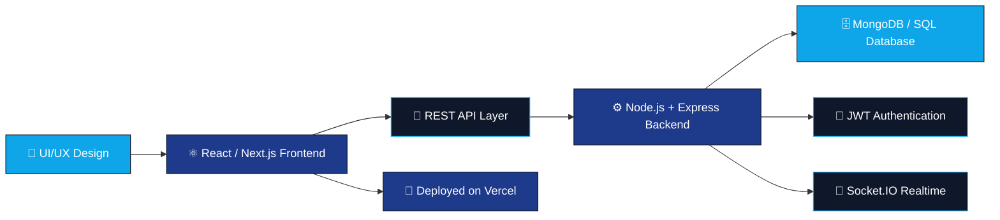
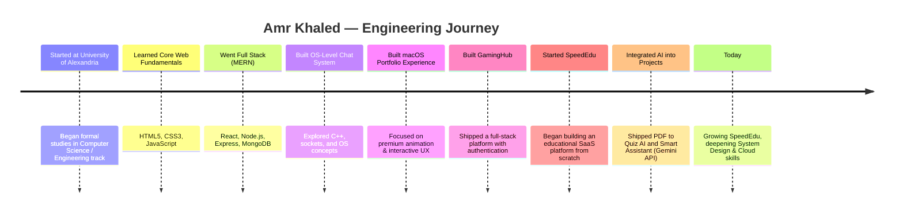

<div align="center">

<!-- ================= HEADER BANNER ================= -->


<!-- ================= TYPING SVG ================= -->
<a href="https://github.com/Amr-khalid">
  
</a>

<br/>


<!-- ================= SOCIAL BADGES ================= -->
<p align="center">
  <a href="https://www.linkedin.com/in/amr-khalid-8a54843a8/">
    
  </a>
  <a href="mailto:ak7055864@gmail.com">
    
  </a>
  <a href="https://github.com/Amr-khalid">
    
  </a>
  
</p>


</div>

<br/>

<!-- ================= ABOUT ME ================= -->
##  About Me

<table>
<tr>
<td>

I'm **Amr Khaled**, a passionate **Full Stack MERN Engineer** from **Kafr El Sheikh, Egypt**, studying at the **University of Alexandria**. I love turning complex problems into **clean, scalable, and premium-feeling products** — from the database schema all the way to the pixel-perfect UI.

I enjoy building:

```txt
🚀 SaaS Products
🎓 Educational Platforms
🤖 AI-Powered Applications
🎨 Modern UI/UX Experiences
🏗️ Backend Architecture
⚡ High Performance Applications
🔗 APIs & Integrations
🧩 System Design
🌍 Open Source Projects
```

I'm currently focused on deepening my knowledge of **system design** and **cloud architecture**, while shipping real products that people actually use.

</td>
</tr>
</table>

<br/>


<!-- ================= TECH STACK ================= -->
##  Tech Stack

<table width="100%">
<tr>
<td width="50%" valign="top">

### 🎨 Frontend

<p>


</p>

</td>
<td width="50%" valign="top">

### ⚙️ Backend

<p>


</p>

</td>
</tr>
<tr>
<td width="50%" valign="top">

### 🗄️ Database

<p>


</p>

</td>
<td width="50%" valign="top">

### 🛠️ Tools

<p>


</p>

</td>
</tr>
</table>

<br/>

<!-- ================= ARCHITECTURE MERMAID ================= -->
##  How I Build Things



<br/>


<!-- ================= FEATURED PROJECTS ================= -->
##  Featured Projects

<br/>

### 🎓 [SpeedEdu](https://github.com/Amr-khalid) — Flagship Project

<table>
<tr>
<td width="100%">

**A modern educational platform built for teachers and students** — my biggest and most ambitious project to date.

<p>


</p>

**Core Features:**

| Feature | Description |
|---|---|
| 📷 **QR Attendance** | Fast, contactless attendance tracking via QR codes |
| 🌐 **Public Teacher Pages** | Shareable public profiles for teachers |
| 📊 **Teacher Dashboard** | Full control center for managing classes & content |
| 🎒 **Student Dashboard** | Personalized space for students to track progress |
| 🏷️ **Branding System** | Custom branding for teachers/institutions |
| 🤖 **AI Features** | AI-powered tools integrated into the learning flow |
| 📝 **Exams** | Full exam creation & management system |
| ❓ **Quizzes** | Interactive quiz engine |
| 📚 **Course Management** | End-to-end course creation & organization |
| 📈 **Analytics** | Insights into student & course performance |
| 📱 **PWA** | Installable, app-like experience |
| 🔐 **Authentication** | Secure login system |
| 🛡️ **Role Permissions** | Fine-grained access control per role |

<p>


</p>

</td>
</tr>
</table>

<br/>

<table>
<tr>
<td width="50%" valign="top">

### 🎮 GamingHub

A modern gaming platform with a sleek UI and full user authentication.

**Highlights:**
- 🎨 Modern, immersive UI
- 🔐 Authentication system
- 🗄️ MongoDB-powered backend
- ⚛️ Built with React
- ⚙️ Node.js server

<p>


</p>

</td>
<td width="50%" valign="top">

### 🖥️ macOS Portfolio Experience

A portfolio website inspired by the macOS interface, with premium animations and interactive windows.

**Highlights:**
- 🪟 Interactive draggable windows
- ✨ Premium, fluid animations
- 🎯 Smooth, intuitive UX
- 🖱️ Desktop-like interaction model

<p>


</p>

</td>
</tr>
<tr>
<td width="50%" valign="top">

### 🤖 Smart Assistant

A voice-controlled IoT assistant built on ESP32, powered by the Gemini API.

**Highlights:**
- 🔌 ESP32 hardware integration
- 🧠 Gemini API for AI responses
- 🎙️ Voice assistant capabilities
- 🌐 IoT connectivity

<p>


</p>

</td>
<td width="50%" valign="top">

### 📄 PDF to Quiz AI

Upload any PDF and instantly generate an AI-powered quiz from its content.

**Highlights:**
- 📤 PDF upload & parsing
- 🤖 AI-generated quiz questions
- 📥 Export questions for reuse

<p>


</p>

</td>
</tr>
</table>

<br/>

### 💻 OS-Level Chat System

A low-level chat system exploring socket programming and operating system concepts, built in C++.

<p>


</p>

<br/>

<!-- ================= SKILLS BREAKDOWN ================= -->
##  Skills Breakdown

<table width="100%">
<tr>
<td width="25%" valign="top">

<div align="center">

### 🎨
**Frontend Development**

`Advanced`

React · Next.js · TypeScript
UI Animation · Responsive Systems

</div>

</td>
<td width="25%" valign="top">

<div align="center">

### ⚙️
**Backend Development**

`Advanced`

Node.js · Express · REST APIs
Auth & Realtime Systems

</div>

</td>
<td width="25%" valign="top">

<div align="center">

### 🗄️
**Database Design**

`Proficient`

MongoDB · Mongoose · SQL
Schema & Query Optimization

</div>

</td>
<td width="25%" valign="top">

<div align="center">

### 🧭
**UI / UX Design**

`Proficient`

Design Systems · Motion Design
User-Centered Interfaces

</div>

</td>
</tr>
<tr>
<td width="25%" valign="top">

<div align="center">

### 🧩
**Problem Solving**

`Advanced`

Algorithmic Thinking
Debugging Complex Systems

</div>

</td>
<td width="25%" valign="top">

<div align="center">

### 💬
**Communication**

`Proficient`

Technical Writing
Team Collaboration

</div>

</td>
<td width="25%" valign="top">

<div align="center">

### 🔗
**API Design**

`Advanced`

RESTful Architecture
Clean, Documented Endpoints

</div>

</td>
<td width="25%" valign="top">

<div align="center">

### 🏗️
**System Design**

`Growing`

Scalable Architecture
Cloud-Oriented Thinking

</div>

</td>
</tr>
</table>

<br/>


<!-- ================= GITHUB STATS ================= -->
##  GitHub Analytics

<div align="center">


<br/>


<br/>


</div>

<br/>

### 🏆 Trophies

<div align="center">

</div>

<br/>

### 🐍 Contribution Snake

<div align="center">

</div>

> 💡 To activate the snake animation above, add the [`github-contribution-grid-snake`](https://github.com/Platane/snk) GitHub Action to this repository — it will generate `github-contribution-grid-snake-dark.svg` automatically on your `output` branch.

<br/>

<!-- ================= TIMELINE ================= -->
##  My Journey



<br/>

<!-- ================= CODING STATS ================= -->
##  Coding Activity

<div align="center">


</div>

> 💡 Coding-time stats above are powered by [WakaTime](https://wakatime.com/). Install the WakaTime editor plugin and link your `wakatime.com` username to `Amr-khalid` for this card to populate automatically.

<div align="center">

| 🗓️ Metric | 📊 Detail |
|---|---|
| **Primary Editor** | VS Code |
| **Most Active Stack** | JavaScript / TypeScript · React · Node.js |
| **Workflow Style** | Feature-branch driven, frequent small commits |
| **Focus Areas Right Now** | System Design · Backend Architecture · SpeedEdu |

</div>

<br/>

<!-- ================= CURRENTLY LEARNING ================= -->
##  Currently Learning

<table width="100%">
<tr>
<td width="33%" valign="top">

<div align="center">

### 🏗️
**System Design**

Scalability · Load Balancing
Caching · Distributed Systems

</div>

</td>
<td width="33%" valign="top">

<div align="center">

### ☁️
**Cloud Architecture**

Deployment Pipelines
Cloud-Native Application Design

</div>

</td>
<td width="33%" valign="top">

<div align="center">

### 🤖
**Applied AI Engineering**

Integrating LLMs & AI APIs
into Real Products

</div>

</td>
</tr>
</table>

<br/>

<!-- ================= BLOG / ARTICLES ================= -->
##  Blog & Articles

<div align="center">

<table>
<tr>
<td align="center">

📝 **No public articles published yet**

I'm planning to start writing about my experience building **SpeedEdu**, MERN architecture decisions, and lessons learned from shipping real products.

<i>This section will auto-populate once articles are published.</i>

</td>
</tr>
</table>

</div>

<br/>

<!-- ================= GOALS ================= -->
##  Current Goals

```yaml
2026_goals:
  - Build a world-class SaaS product
  - Become a Senior Full Stack Engineer
  - Master System Design
  - Master Cloud Architecture
  - Contribute to Open Source
  - Build a Startup
```

<br/>


<!-- ================= CONTACT ================= -->
##  Let's Connect

<div align="center">

<table>
<tr>
<td align="center" width="20%">
<a href="https://github.com/Amr-khalid">
<br/>
<b>GitHub</b>
</a>
</td>
<td align="center" width="20%">
<a href="https://www.linkedin.com/in/amr-khalid-8a54843a8/">
<br/>
<b>LinkedIn</b>
</a>
</td>
<td align="center" width="20%">
<a href="mailto:ak7055864@gmail.com">
<br/>
<b>Email</b>
</a>
</td>
<td align="center" width="20%">
<a href="https://wa.me/201024556910">
<br/>
<b>WhatsApp</b>
</a>
</td>
<td align="center" width="20%">
<a href="https://www.google.com/maps/place/Kafr+El+Sheikh">
<br/>
<b>Kafr El Sheikh, Egypt</b>
</a>
</td>
</tr>
</table>

<br/>


</div>

<br/>

<div align="center">

### 💭 "Great software is built one clean commit at a time."


</div>
