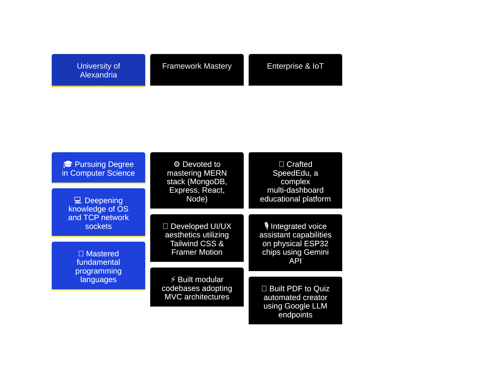

<div align="center">

<!-- Retro Pixel-Art Space Header -->


<!-- Retro Terminal Typing Name -->
<a href="https://git.io/typing-svg">
  
</a>

<!-- Animated Digital Network Hologram Banner -->
<picture>
  <source media="(prefers-color-scheme: dark)" srcset="https://media.giphy.com/media/SWoRK259VVWzRe7imy/giphy.gif">
  
</picture>

<!-- Cyber Typing Effect with Multiple Lines -->
<a href="https://git.io/typing-svg">
  
</a>

<!-- Futuristic Social Badges -->
<p align="center">
  <a href="https://www.linkedin.com/in/amr-khalid-8a54843a8/">
    
  </a>
  <a href="mailto:ak7055864@gmail.com">
    
  </a>
  <a href="https://github.com/Amr-khalid">
    
  </a>
</p>

<!-- Live Visitor Counter with Gradient -->


</div>

---

<!-- Bio Section with Glassmorphism Effect -->
<div align="center">

##  ABOUT THE ARCHITECT

</div>

<table width="100%">
<tr>
<td width="55%" valign="top">

```javascript
// Full Stack MERN Engineer
const amrKhaled = {
  name: "Amr Khaled",
  role: "Senior Full Stack MERN Engineer",
  location: "Kafr El Sheikh, Egypt 🇪🇬",
  education: "University of Alexandria 🎓",
  skills: {
    frontend: ["TS/JS", "React", "Next.js", "Tailwind", "Redux", "Framer Motion"],
    backend: ["Node.js", "Express.js", "Socket.IO", "REST APIs", "JWT", "MVC"],
    database: ["MongoDB", "Mongoose", "SQL"],
    tools: ["Git/GitHub", "Postman", "Cloudinary", "Vercel", "npm"]
  },
  passions: [
    "Building world-class SaaS platforms",
    "Architecting high-performance educational software",
    "Integrating AI engines into web applications",
    "Designing intuitive, fluid UI/UX with smooth micro-interactions",
    "Crafting reliable backend and system architectures",
    "Contributing to open-source software"
  ],
  motto: "Transforming complex requirements into simple, elegant, and blazing-fast code."
};
```

</td>
<td width="45%" valign="top">


### 🎓 EDUCATION
**BSc in Computer Science & Engineering**  
📍 University of Alexandria  
🌍 Egypt  

### 💼 PROFESSIONAL FOCUS
**Full Stack MERN Development**  
- SaaS Architecture  
- Educational Systems  
- IoT & AI Integration  

### 🌟 QUICK STATS
- 🚀 **6+** Major Projects Developed
- 💻 Modern Single Page & PWA Apps
- ⚙️ Restful & Real-Time Event-Driven API Architectures
- 🎨 Responsive Fluid Layouts & Interactive Visuals

</td>
</tr>
</table>

<div align="center">

</div>

---

<!-- Tech Stack with Neon Glow Effect -->
<div align="center">

##  TECH WEAPONRY


### 💻 **FRONTEND DEVELOPMENT**
<p>


</p>

### ⚙️ **BACKEND ARCHITECTURE**
<p>


</p>

### 🗄️ **DATABASE SYSTEMS**
<p>


</p>

### 🛠️ **DEVELOPMENT UTILITIES & CLOUD**
<p>


</p>

</div>

<div align="center">

</div>

---

<!-- Premium Project Showcase -->
<div align="center">

##  FLAGSHIP ARCHITECTURES

</div>

<table width="100%">

<!-- Row 1: SpeedEdu & GamingHub -->
<tr>
<td width="50%" valign="top">

<div align="center">

### 🎓 **SpeedEdu - Advanced Learning Platform**


[](https://github.com/Amr-khalid)
[](https://github.com/Amr-khalid)
[](https://github.com/Amr-khalid)
[](https://github.com/Amr-khalid)

</div>

```yaml
📦 Classification: Enterprise Educational SaaS
🛠️ Architecture: MERN Stack + WebSockets
🔥 Core Value: Streamlined school & teacher pipelines
```

**🚀 KEY HIGHLIGHTS:**
- 📲 **QR Code Attendance System** for seamless live student checking.
- 👨%26emsp; **Public Teacher Portals** and private, analytics-rich **Teacher/Student Dashboards**.
- 🤖 **AI-powered features** assisting inside exams, quizzes, and course material generation.
- 🎨 Custom branding suite, robust role/permission controls, and responsive PWA layout.

---

</td>

<td width="50%" valign="top">

<div align="center">

### 🎮 **GamingHub - Next-Gen Gaming Portal**


[](https://github.com/Amr-khalid)
[](https://github.com/Amr-khalid)
[](https://github.com/Amr-khalid)
[](https://github.com/Amr-khalid)

</div>

```yaml
🎯 Classification: Interactive Entertainment Hub
🔒 Authentication: Secure Session & JWT Control
⚡ Front-End: Rich Animations & Dark Mode Theme
```

**🚀 KEY HIGHLIGHTS:**
- 🎨 **Modern Gaming UI/UX** designed with vibrant components and flawless interactivity.
- 🔐 Secure JWT Authentication with detailed account setups and preference saving.
- 📂 Structured MongoDB schemas linking active lists of games, ratings, and user libraries.
- 💬 Real-time API calls fetching dynamically sorted game categories.

---

</td>
</tr>

<!-- Row 2: macOS Portfolio Experience & Smart Assistant -->
<tr>
<td width="50%" valign="top">

<div align="center">

### 🖥️ **macOS Portfolio Experience**


[](https://github.com/Amr-khalid)
[](https://github.com/Amr-khalid)
[](https://github.com/Amr-khalid)

</div>

```yaml
🎭 Theme: macOS-inspired Interactive Portfolio
✨ Micro-interactions: Physics-based fluid windows
📈 Rendering: Blazing fast static Next.js setup
```

**🚀 KEY HIGHLIGHTS:**
- 🖥️ Immersive desktop simulator with resizable, draggable, and stackable program windows.
- 🌟 Drag-drop elements, custom dock animations, and realistic widget settings.
- 💫 Premium performance tuning using specialized Framer Motion configuration.
- 📱 Responsive viewport simulation supporting desktop, tablet, and mobile layouts.

---

</td>

<td width="50%" valign="top">

<div align="center">

### 🎙️ **Smart Assistant IoT Voice Node**


[](https://github.com/Amr-khalid)
[](https://github.com/Amr-khalid)
[](https://github.com/Amr-khalid)

</div>

```yaml
🔌 Hardware: ESP32 Microcontroller
🤖 Cognitive Engine: Google Gemini LLM API
🎤 Inputs: Real-time Audio Parsing & Synthesis
```

**🚀 KEY HIGHLIGHTS:**
- 🎙️ Sound capturing and streaming architecture directly connecting ESP32 to online AI nodes.
- 🧠 Powered by Gemini API to respond to vocal requests, questions, and commands.
- ⚡ Smart IoT relays triggering physical actions based on Gemini's parsed responses.
- 🛰️ Low latency networking optimized for immediate assistant voice responses.

---

</td>
</tr>

<!-- Row 3: PDF to Quiz AI & OS-Level Chat System -->
<tr>
<td width="50%" valign="top">

<div align="center">

### 📄 **PDF to Quiz AI Generator**


[](https://github.com/Amr-khalid)
[](https://github.com/Amr-khalid)
[](https://github.com/Amr-khalid)

</div>

```yaml
📄 Parser: PDF Document Stream Extraction
🤖 AI Model: Structured JSON output parsing
📊 Outputs: Customizable formats (CSV, PDF, interactive)
```

**🚀 KEY HIGHLIGHTS:**
- 📤 Upload multi-page files directly into the client-side dashboard securely.
- 🧠 Automatic text tokenization feeding directly into LLM prompts.
- 📝 Generates highly precise quizzes, multiple-choice questions, and answers.
- 📥 Instantly export quizzes into digital formats or test papers with key solutions.

---

</td>

<td width="50%" valign="top">

<div align="center">

### 💬 **OS-Level Multi-Client Chat System**


[](https://github.com/Amr-khalid)
[](https://github.com/Amr-khalid)
[](https://github.com/Amr-khalid)

</div>

```yaml
💬 System: Command Line & Interface Node
⚡ Tech: C++ TCP Sockets & Threads
⚙️ Concept: CPU Scheduling & Process Isolation
```

**🚀 KEY HIGHLIGHTS:**
- 📡 Scalable TCP socket implementation supporting multiple concurrent connection channels.
- 🧵 Multithreading architectures prevents channel blocks, processing signals in parallel.
- 💾 OS concepts applied to optimize message delivery queues and reduce CPU cycle usage.
- 🛠️ Robust error handling guarding active ports and preventing server-side socket leaks.

---

</td>
</tr>

</table>

<div align="center">

</div>

---

<!-- Skills Section with Beautiful Progress Bars -->
<div align="center">

##  CORE COMPETENCIES & EXPERTISE

</div>

<table width="100%">
<tr>
<td width="50%" valign="top">

### 🎨 **FRONTEND DEVELOPMENT**

| Technology | Level | Core Focus |
| :--- | :--- | :--- |
| **TypeScript / JS** | `⚡ Expert` | ESNext, Strict Typing, Async Flow |
| **React / Next.js** | `🛡️ Architect` | Server Components, Hooks, SSR/ISR |
| **CSS3 / Tailwind** | `🎨 Stylist` | Responsive Fluid UIs, Glassmorphism |
| **Redux Toolkit** | `⚙️ Orchestrator` | Global State, Async Thunk Pipelines |
| **Framer Motion** | `✨ Animator` | Micro-interactions, Fluid Transitions |
| **PWA Features** | `📲 Implementer` | Service Workers, Offline Caching |

### ⚙️ **BACKEND & DATABASE**

| Technology | Level | Core Focus |
| :--- | :--- | :--- |
| **Node / Express** | `⚡ Engineer` | Event Loop, Middleware Systems |
| **RESTful APIs** | `🔌 Designer` | MVC Pattern, Clean Endpoint Routing |
| **JWT / Auth** | `🔑 Guard` | Token Validation, Crypto Password Hashing |
| **Socket.IO** | `🔄 Streamer` | Real-time Events, Room Subscriptions |
| **MongoDB / SQL** | `🗄️ Database` | Aggregations, Indexing, Joins |

</td>
<td width="50%" valign="top">

### 🛠️ **SYSTEM DESIGN & UTILITIES**

| Paradigm / Tool | Focus & Details |
| :--- | :--- |
| **System Design** | Distributed Architectures, Modular APIs |
| **Problem Solving** | Algorithmic Logic, Data Structures |
| **UI/UX Engineering** | Visual Hierarchy, Performance Auditing |
| **API Testing** | Postman Collections, Request Mocking |
| **Git / Versioning** | Semantic Commits, Rebase Workflows |

### 🌟 **DEVELOPMENT BEST PRACTICES**

- 🧩 **Clean Architecture & SOLID Principles**: Striving for low coupling and highly cohesive micro-systems.
- ⚡ **Performance Auditing**: Minimizing render paths, image assets compression, code-splitting.
- 🌐 **Security First**: Cryptographic password hashing, JSON Web Tokens validation, route-guarding, sanitizing queries.
- 🔄 **Real-Time Synchronicity**: Leveraging Event-Driven programming using Socket.IO for seamless messaging.

</td>
</tr>
</table>

<div align="center">

</div>

---

<!-- GitHub Statistics Dashboard -->
<div align="center">

##  GITHUB COCKPIT & SPACE STATS

</div>

<table width="100%">
<tr>
<td width="35%" valign="top" align="center">

<!-- Futuristic Cartoon Robot Coding -->


<br/><br/>

<!-- Snake Contribution Graph -->
<picture>
  <source media="(prefers-color-scheme: dark)" srcset="https://raw.githubusercontent.com/Amr-khalid/Amr-khalid/output/github-contribution-grid-snake-dark.svg">
  <source media="(prefers-color-scheme: light)" srcset="https://raw.githubusercontent.com/Amr-khalid/Amr-khalid/output/github-contribution-grid-snake.svg">
  
</picture>

</td>
<td width="65%" valign="top">

<!-- Cyberpunk Neon Stats Grid -->
<table width="100%">
<tr>
<td>

</td>
</tr>
<tr>
<td>

</td>
</tr>
<tr>
<td>

</td>
</tr>
<tr>
<td>

</td>
</tr>
</table>

</td>
</tr>
</table>

<div align="center">

<!-- Contribution Stats Summary -->


</div>

<div align="center">

</div>

---

<!-- Trophy Case -->
<div align="center">

##  TROPHY CABINET


</div>

<div align="center">

</div>

---

<!-- Professional Experience Timeline -->
<div align="center">

##  PROFESSIONAL JOURNEY & MILESTONES

</div>



<div align="center">

</div>

---

<!-- Contact & Collaboration Section -->
<div align="center">

##  LET'S BUILD SOMETHING OUTSTANDING TOGETHER


### 🌐 **CONNECT WITH ME**

<p align="center">
  <a href="https://www.linkedin.com/in/amr-khalid-8a54843a8/">
    
  </a>
  <a href="mailto:ak7055864@gmail.com">
    
  </a>
  <a href="https://github.com/Amr-khalid">
    
  </a>
</p>

### 📞 **CONTACT INFORMATION & GEOGRAPHY**

<table align="center">
<tr>
<td align="center" width="25%">

<br/>
<strong>Email</strong>
<br/>
<code>ak7055864@gmail.com</code>
</td>
<td align="center" width="25%">

<br/>
<strong>Phone</strong>
<br/>
<code>+20 102 455 6910</code>
</td>
<td align="center" width="25%">

<br/>
<strong>Location</strong>
<br/>
<code>Kafr El Sheikh, Egypt 🇪🇬</code>
</td>
<td align="center" width="25%">

<br/>
<strong>Languages</strong>
<br/>
<code>Arabic (Native) | English</code>
</td>
</tr>
</table>

</div>

<div align="center">

</div>

---

<!-- Quote of the Day & Goals -->
<div align="center">

## 💭 **DAILY INSPIRATION**


<br/>


### 🎯 **CORE GOALS**

```javascript
const myGoals = {
  saas: "Build world-class SaaS platforms that solve real user friction.",
  career: "Evolve into a highly skilled Senior Full Stack Engineer.",
  architecture:
    "Master System Design, scaling architectures, and Distributed Systems.",
  infrastructure: "Master Cloud Infrastructure & Serverless pipelines.",
  openSource: "Actively contribute to mainstream open-source packages.",
  entrepreneurship: "Co-found a high-growth tech startup.",
};

Object.entries(myGoals).forEach(([key, goal]) => {
  console.log(`[🎯 ${key.toUpperCase()}]: ${goal}`);
});
```

### ⚡ **FUN FACTS ABOUT ME**

```markdown
🎮 When I'm not writing server endpoints, I'm analyzing frontend framer motion physics
🧠 I write UI code that makes designers smile and database designs that keep servers happy
☕ Kept operational by hot coffee, good music, and solved tickets
🌙 Night Owl: My brain fires best when the rest of the world goes offline
🎯 Obsessed with optimizing render operations and styling pixel-perfect layout nodes
```

</div>

<div align="center">

</div>

---

<!-- Footer Section -->
<div align="center">

### 💼 **OPEN TO OPPORTUNITIES**


<h3>
🚀 Available for:
<br/>
<code>Full-Time Roles</code> | <code>SaaS Collaborations</code> | <code>Freelance Projects</code> | <code>Open Source Partnerships</code>
</h3>

**Specialized in Full Stack MERN Development, API Integrations, and Modern UI Interfaces**

<br/>

### ⭐ **IF YOU APPRECIATE MY PROJECTS, LEAVE A STAR!**


<br/>

### 📊 **METRIC HIGHLIGHTS**

<table align="center">
<tr>
<td align="center">

</td>
<td align="center">

</td>
<td align="center">

</td>
</tr>
</table>

<br/>

---

<h3>
💡 "Great software architecture isn't just about code that executes; it's about systems that stand resilient, scale seamlessly, and deliver joy to the user."
<br/>
<sub>- Amr Khaled</sub>
</h3>

<br/>


<br/><br/>

**Made with** ❤️ **and lots of** ☕ **by Amr Khaled**

<sub>Last Updated: July 2026 | Built with passion for Web Development & System Design</sub>

<br/>

</div>

<!-- Final Wave Footer -->

